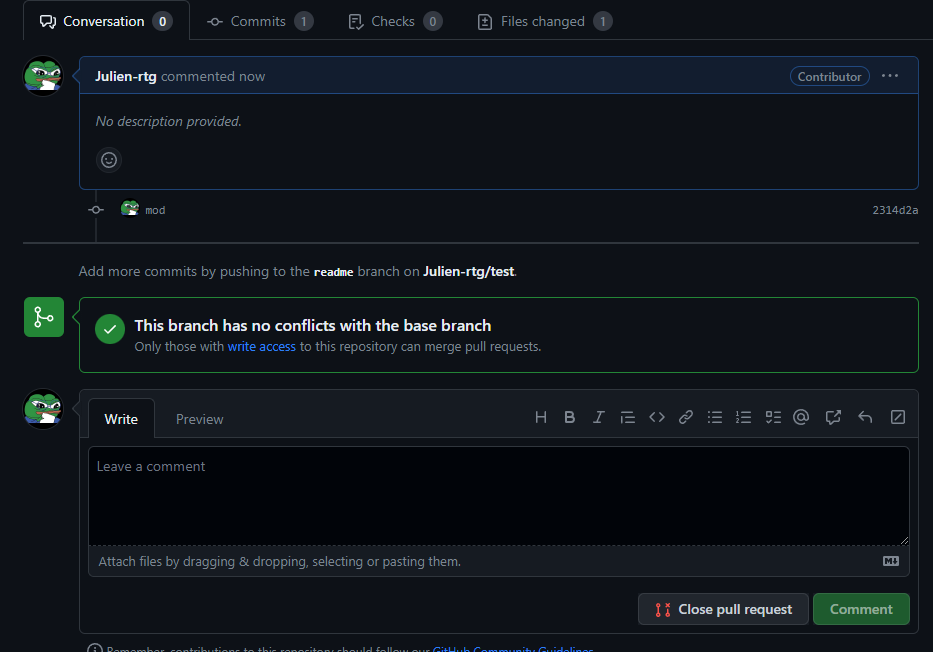

**UTILISATION DE GIT**

**\
**

# Table des matières {#table-des-matières .TOC-Heading}

[1. Création du compte git
[3](#création-du-compte-git)](#création-du-compte-git)

[2. Télécharger gitbash [3](#télécharger-gitbash)](#télécharger-gitbash)

[3. Cloner le projet
[3](#accéder-et-cloner-le-projet)](#accéder-et-cloner-le-projet)

[4. Modification du projet
[4](#modification-du-projet)](#modification-du-projet)

[A. Création branche [4](#création-branche)](#création-branche)

[B. Envoi des modifications
[4](#envoi-des-modifications)](#envoi-des-modifications)

[C. Création pull request
[4](#création-pull-request)](#création-pull-request)

[5. Règles à respecter [6](#règles-à-respecter)](#règles-à-respecter)

# Création du compte git

> Se rendre sur ce lien : https://github.com/signup

# Télécharger gitbash

> Se rendre sur ce lien pour télécharger git :
> <https://gitforwindows.org/>

# Accéder et Cloner le projet

> Pour pouvoir accéder au projet il faudra fork le projet sur votre
> profil pour pouvoir y travailler dessus.
>
> Cliquez sur le bouton en haut à droite « Fork ».

{width="6.03125in"
height="4.08125in"}

> Une fois gitbash installé, lancer le et diriger vous vers le dossier
> ou vous voulez cloner le projet.
>
> Cloner le projet avec la commande : git clone
> <https://github.com/Julien-rtg/P_8.git>
>
> Dans le cas ou vous voulez clonez le projet P_8 du profil Julien-rtg

# Modification du projet

## Création branche

> Avant d'envoyer les modifications il faut faire une branche pour
> indiquer dans quelle partie de l'application nous voulons faire nos
> modifications.
>
> Faites la commande git checkout -b « nom de la branche ».

## Envoi des modifications

> Une fois les modifications au projet réalisé.
>
> Faites un « git add . » pour ajouter tous les fichiers
>
> Faites un « git commit -m « message du commit » » pour sauvegarder les
> fichiers
>
> Faites un git push pour envoyer les fichiers sur le dossier distant.
>
> Remarque : Une fenêtre va s'ouvrir pour s'authentifier à votre compte
> si vous n'étiez pas déjà authentifié.

## Création pull request

> Rendez-vous sur la page <https://github.com/Julien-rtg/P_8/pulls> pour
> créer la pull request. Ou sur la page du repository et dans l'onglet
> pull request si c'est un autre projet.
>
> Cliquez sur « compare & pull request », ce sont les modifications que
> vous avez apportés au projet.
>
> {width="6.083333333333333in"
> height="0.47291666666666665in"}

Sur cette page nous avons en haut ces éléments

{width="6.3in"
height="1.0819444444444444in"}

> Base repository étant le repository ou vous avez clonez le projet de
> base.
>
> Base étant la branche sur laquelle vous voulez comparer vos
> changements
>
> Head repository étant le repository que vous avez fork sur votre
> profil
>
> Compare étant la branche sur laquelle vous avez fait les changements
>
> Vous voulez donc comparer les changements de votre projet fork au
> projet de base pour pouvoir créer la pull request.

Cliquez sur « Create pull request » pour créer la pull request

{width="6.3in"
height="0.9388888888888889in"}

Vous atterrissez sur cette page, cela signifie que la pull request à
bien été effectué.

{width="6.3125in"
height="4.402777777777778in"}

Maintenant du coté du propriétaire du repository de base, dans l'onglet
pull request nous avons :

{width="6.3in"
height="1.0319444444444446in"}

En cliquant sur la pull request nous pouvons merge la pull request qui
nous permettra de rassembler les informations au projet de base

{width="6.3in"
height="2.3743055555555554in"}

# Règles à respecter

> Les règles à respecter lors de l'utilisation de git sont de :

-   Utiliser des branches lorsque vous voulez faire des changements au
    niveau du projet

-   Faire des messages les plus explicites au possible lors des commits
